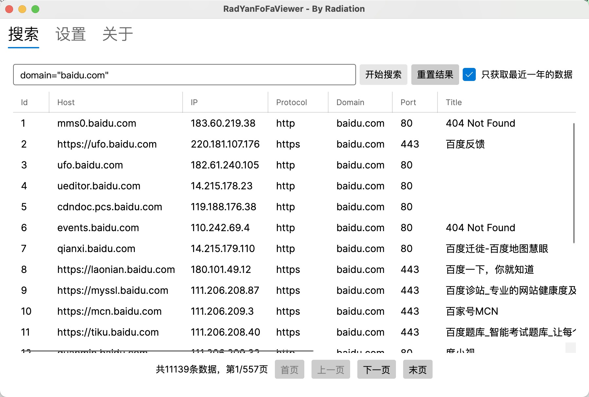

#### RadYanFoFaViewer -- 基于.Net6的FoFa客户端

`RadYanFoFaViewer`是一款基于.Net6的跨平台的FoFa客户端，目前只有基本的搜索和设置功能，后续会不断添加一些新功能上去，使其更加好用。

本人是个编程菜鸟，也是第一次使用.Net编写跨平台的，因此软件写的比较烂，对于FoFa的使用也是一知半解，所以希望大家不管是功能上的建议还是编程风格上的建议或者其他的建议都可以提出来，非常感谢！

#### 软件预览

#### TODO

- [ ]  搜索历史

- [ ]  结果导出

- [ ]  在线更新

- [ ]  常用语法

- [ ]  不断优化代码

